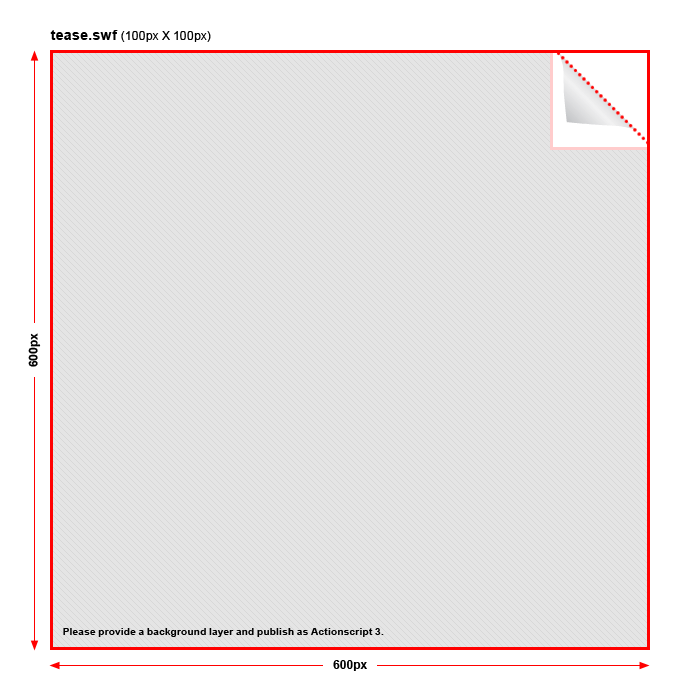

# Peel

**Page peel/ear advertisement source code.**

	

Example (ad by Kendalll Auto.)

	

The “tease” guide.

	

The “advert” guide.

## Features

* Communicates with [javascript](http://en.wikipedia.org/wiki/JavaScript)/[jQuery](http://jquery.com/).
* “[clickTAG](http://www.123-banner.com/flashbanner_clicktag.php)”.
* HTTP [cookie support](http://en.wikipedia.org/wiki/HTTP_cookie.
* Easily specify the tease and main advertisement (defaults are “tease.swf” & “advert.swf”).
* Control the timing of the the “open” state.
* Fluid animation(s).

## Dependency

[me.hulse.util](https://github.com/mhulse/me.hulse.util)

---

#### LEGAL

Copyright © 2009-14 [Micky Hulse](http://mky.io).

Licensed under the Apache License, Version 2.0 (the “License”); you may not use this work except in compliance with the License. You may obtain a copy of the License in the LICENSE file, or at:

[http://www.apache.org/licenses/LICENSE-2.0](http://www.apache.org/licenses/LICENSE-2.0)

Unless required by applicable law or agreed to in writing, software distributed under the License is distributed on an “AS IS” BASIS, WITHOUT WARRANTIES OR CONDITIONS OF ANY KIND, either express or implied. See the License for the specific language governing permissions and limitations under the License.

